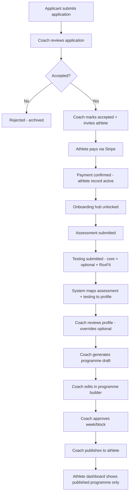
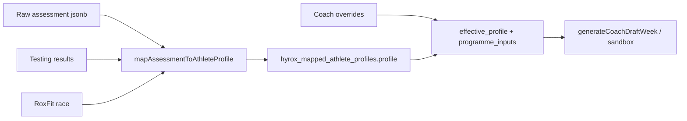

# Hybrid365 Hyrox Team — Backend Implementation Plan

**Status:** Planning document (no implementation yet)  
**Last updated:** May 2026  
**Audience:** Product + engineering before Supabase/Stripe wiring

---

## Executive summary

The Hyrox Team product is fully navigable in the app today using **mock data, local React state, Formspree, and sessionStorage**. The intended production system is a **coach-gated publishing pipeline**: athletes never see a programme until a coach explicitly publishes after review.

**Non-negotiable rule:** Assessment and testing completion must **never** auto-publish a programme to the athlete. Publishing is always a deliberate coach action.

Existing infrastructure in this repo:

- **Supabase Auth + Postgres** already powers the main Hybrid365 dashboard (`/dashboard/*`, middleware on that path).
- **Hyrox Team routes** (`/hyrox-team`, `/athlete/*`, `/admin/hyrox-athletes/*`) are currently **unauthenticated** and **unpersisted**.
- **Stripe Payment Links** are wired via `NEXT_PUBLIC_STRIPE_HYROX_*` env vars; success URL should land on `/athlete/onboarding`.
- **Assessment mapping** logic exists in `app/lib/hyroxAssessmentMapping.ts` and types in `app/lib/hyroxAthleteProfileTypes.ts` — ready to run server-side once raw data is stored.
- **Programme builder** uses `app/lib/hyroxCoachProgrammeDraft.ts`, session library (`app/lib/hyroxCoachSessionLibrary*.ts`, `src/lib/hyrox/sessionLibrary.ts`), and mock publish in `PublishBar`.

This document proposes a **new Hyrox-specific schema** (or clearly namespaced tables) on Supabase, separate from the legacy 12-week membership programme tables where practical.

---

## 1. Current mocked flow

### Public / marketing

| Route | Current behaviour |
|-------|-------------------|
| `/hyrox-team` | Marketing landing: hero with YouTube trailer (`CnZLXozIW-4`), CTAs to apply and scroll sections. No auth. |
| `/hyrox-team/apply` | Multi-section application form; **client POST to Formspree** (`xlgznozk`). On success, in-page “application received” state (no payment redirect). Legacy redirect URL still points at `/hyrox-team/thank-you`. |
| `/hyrox-team/thank-you` | Static confirmation page for Formspree redirects. |
| `/hyrox-team/accepted` | **Open page** for manually approved athletes: copy + Stripe Payment Link buttons (monthly / 12-week / 16-week). No server check that user was accepted. |
| `/hyrox-team/payment` | Pricing cards + same Stripe links + post-payment copy pointing to `/athlete/onboarding`. |

### Athlete portal (mock)

| Route | Current behaviour |
|-------|-------------------|
| `/athlete/onboarding` | Static timeline + CTAs to assessment, testing, dashboard. Assumes payment happened; no verification. |
| `/athlete/assessment` | Multi-step UI (`AssessmentFormShell` + `assessmentStepContent`). **No save** — fields are uncontrolled defaults; navigation only. |
| `/athlete/testing` | Core tests (5k, 1km Ski, 2km Row, mini compromised), RoxFit race modal, optional strength tests. **`useState` + modals**; data lost on refresh. Types in `hyroxTestingTypes.ts`. |
| `/athlete/dashboard` | **Locked “programme building”** view by default. Full hub unlocks only when `programmePublishedMock` is true in **sessionStorage** (`hyrox-athlete-programme-live-mock`). |
| `/athlete/programme` | Wrapped in `AthletePortalGate` — same mock flag; shows programme UI when “live”. |
| `/athlete/check-in`, `/benchmarks`, `/coach-notes`, `/resources`, `/progress`, `/race-prep` | Same gate pattern; mock content when unlocked. |

**Athlete layout:** `AthletePortalProvider` wraps all `/athlete/*` routes.

### Coach / admin (mock)

| Route | Current behaviour |
|-------|-------------------|
| `/admin/hyrox-athletes` | Coach roster from `hyroxCoachMockAthletes.ts` — filters, status badges, links to athlete detail. **No auth.** |
| `/admin/hyrox-athletes/[id]` | Tabbed coach workspace: Overview, Assessment, Testing, Profile Review, Programme Builder, Check-Ins, Coach Notes. Profile from `mapAssessmentToAthleteProfile` + mock assessment. Draft generation via `generateCoachDraftWeek`. **PublishBar** sets local `CoachProgrammeStatus` including `published` — does not write to athlete DB. |
| `/admin/hyrox-programme-preview` | Internal sandbox to preview/edit programme structure with mock inputs. |
| **Session library** | **Not a standalone route.** Embedded in **Programme Builder** tab via `SessionLibraryPanel` (~75 curated entries in `hyroxCoachSessionLibraryData.ts` + engine library in `src/lib/hyrox/sessionLibrary.ts`). |

### Supporting libraries (already built, not persisted)

| Module | Role |
|--------|------|
| `hyroxAssessmentMapping.ts` | Assessment + testing → `HyroxAthleteProfile`, coach overrides, programme inputs |
| `hyroxCoachProgrammeDraft.ts` | Draft week generation, validation, status machine (`generated_draft` → `published`) |
| `hyroxTestingTypes.ts` | Discriminated benchmark payloads + `AthleteBaselineTestingSnapshot` |
| `hyroxCoachMockAthletes.ts` | Roster, list status, programme inputs |
| `hyroxMockAssessmentSubmissions.ts` | Per-athlete mock assessments for coach UI |

---

## 2. Desired real client flow

**Athlete-visible programme:** Only rows with `programme_status = published` (and explicit `published_at` / version). Draft and approved-not-published rows are coach-only.

**Coach-visible:** Applications, all assessment/testing raw JSON, mapped profile, draft history, publish history, session library, notes, check-ins.

---

## 3. User roles and auth

### Roles

| Role | Description |
|------|-------------|
| **Public** | Can view landing, submit application. Cannot access athlete portal or admin. |
| **Applicant** | Submitted application; may have magic link or email but no athlete portal until accepted + paid. |
| **Athlete** | Accepted, paid (or comped), linked `auth.users` id. Can complete assessment/testing and view **published** programme. |
| **Coach / Admin** | Hybrid365 staff. Full coach dashboard, mapping overrides, programme builder, publish. |

Implement via `profiles.role` enum: `public` is implicit (unauthenticated); use `athlete`, `coach`, `admin` (admin inherits coach).

### Who can see what

| Resource | Public | Athlete | Coach |
|----------|--------|---------|-------|
| Landing / apply | ✓ | ✓ | ✓ |
| Accepted / payment pages | ✓ (link-only security) | ✓ if invited | ✓ |
| Own assessment/testing (raw) | — | ✓ own row only | ✓ all athletes |
| Mapped profile | — | Summary only (optional) | ✓ full + overrides |
| Programme draft | — | **Never** | ✓ |
| Published programme | — | ✓ own | ✓ all |
| Applications roster | — | — | ✓ |
| Session library | — | — | ✓ |

### When dashboard unlocks

| Stage | Athlete dashboard |
|-------|-------------------|
| Not accepted / not paid | Redirect to onboarding or “pending access” — **no programme nav** |
| Paid, pre-assessment | Onboarding + links to assessment/testing; **locked programme** |
| Assessment/testing in progress | Locked programme + progress indicators |
| Coach building draft | Locked programme + “coach reviewing” copy (current `HyroxTeamDashboardLocked` pattern) |
| **Published** | Full portal: programme, check-ins, benchmarks, etc. |

**Gate on server:** `athletes.portal_unlocked_at` or `athletes.onboarding_status >= programme_published` — never client-only sessionStorage.

### Athlete access gating

1. Supabase Auth session required on `/athlete/*` (except maybe a public “pending” page).
2. RLS: `athlete.user_id = auth.uid()` for athlete-owned rows.
3. Middleware or layout loader checks `athletes` row exists and `payment_status = paid` (or manual comp).
4. Programme pages additionally require existence of `programme_weeks` (or blocks) with `status = published` for current cohort.

### Admin route protection

1. Middleware matcher extended to `/admin/hyrox-athletes`, `/admin/hyrox-programme-preview`.
2. Server layout verifies `profiles.role IN ('coach', 'admin')`.
3. Service role **only** on server routes/webhooks — never exposed to browser.
4. Consider separate subdomain or path prefix in production (`coach.hybrid365.com`).

**Note:** Main app middleware today only covers `/dashboard/*` — Hyrox needs its own guard.

---

## 4. Supabase table proposal

Naming prefix recommendation: `hyrox_` to avoid collision with existing membership tables.

### `profiles` (extend or unify)

| Purpose | Link Supabase Auth user to app role and display identity. |
|---------|----------------------------------------------------------|
| **Key fields** | `id` (uuid, FK `auth.users`), `email`, `full_name`, `role` (`athlete` \| `coach` \| `admin`), `avatar_url`, `created_at`, `updated_at` |
| **Relationships** | 1:1 with `auth.users`; optional 1:1 `athletes` for athletes |

### `hyrox_applications`

| Purpose | Store Team 001 applications (replace Formspree as source of truth). |
|---------|---------------------------------------------------------------------|
| **Key fields** | `id`, `email`, `full_name`, `instagram`, `location`, `hyrox_experience`, `hyrox_pb`, `five_km_time`, `upcoming_race`, `weekly_training`, `main_goal`, `weakness`, `training_history`, `documented_consent`, `team_training`, `why_join`, `status`, `reviewed_by`, `reviewed_at`, `rejection_reason`, `raw_payload` (jsonb), `created_at` |
| **Relationships** | Optional FK `athlete_id` once accepted and account created |
| **Statuses** | See §5 Application |

### `hyrox_athletes`

| Purpose | Accepted athlete record — hub for onboarding, payment, publish state. |
|---------|-----------------------------------------------------------------------|
| **Key fields** | `id`, `user_id` (nullable until account created), `application_id`, `email`, `full_name`, `cohort` (e.g. `team_001`), `onboarding_status`, `payment_status`, `stripe_customer_id`, `stripe_subscription_id` (nullable), `accepted_at`, `paid_at`, `portal_unlocked_at`, `current_programme_block_id`, `race_name`, `race_date`, `race_category`, `created_at`, `updated_at` |
| **Relationships** | 1:1 `profiles` (when linked); 1:n assessments, testing, race results, programme blocks |

### `hyrox_athlete_assessments`

| Purpose | Versioned assessment submissions (multi-step form serialized). |
|---------|----------------------------------------------------------------|
| **Key fields** | `id`, `athlete_id`, `version`, `status` (`draft` \| `submitted`), `submitted_at`, `payload` (jsonb — mirrors `HyroxAssessmentInput`), `completion_percent`, `created_at` |
| **Relationships** | n:1 `hyrox_athletes`; triggers mapping job on `submitted` |

### `hyrox_athlete_testing_results`

| Purpose | Individual benchmark submissions (core + optional). |
|---------|-----------------------------------------------------|
| **Key fields** | `id`, `athlete_id`, `test_key` (`5k`, `ski`, `row2k`, `compromised`, `farmer_hold`, etc.), `kind` (discriminant matching `BenchmarkSubmission`), `payload` (jsonb), `submitted_at`, `updated_at` |
| **Relationships** | n:1 `hyrox_athletes`; unique optional `(athlete_id, test_key)` for latest |

### `hyrox_race_results`

| Purpose | RoxFit / recent HYROX Solo race split submission. |
|---------|---------------------------------------------------|
| **Key fields** | `id`, `athlete_id`, `race_location`, `race_date`, `category`, `total_finish_time`, `bodyweight_kg`, `race_notes`, `run_splits` (jsonb), `station_splits` (jsonb), `worst_station`, `worst_run`, `biggest_limiter`, `unusual`, `roxfit_screenshot`, `submitted_at` |
| **Relationships** | 0–1 active per athlete (or versioned) |

### `hyrox_mapped_athlete_profiles`

| Purpose | Output of mapping pipeline + coach overrides — input to programme generator. |
|---------|-------------------------------------------------------------------------------|
| **Key fields** | `id`, `athlete_id`, `assessment_id`, `mapped_at`, `mapper_version`, `profile` (jsonb — `HyroxAthleteProfile`), `overrides` (jsonb — `ProfileReviewOverrides`), `effective_profile` (jsonb — merged), `programme_inputs` (jsonb — `CoachAthleteProgrammeInputs`), `coach_reviewed_at`, `coach_reviewed_by`, `flags` (jsonb) |
| **Relationships** | 1:1 latest per athlete (or versioned); source for `hyrox_programme_blocks` |

### `hyrox_programme_blocks`

| Purpose | A training block (e.g. 12-week Team cohort) for one athlete. |
|---------|--------------------------------------------------------------|
| **Key fields** | `id`, `athlete_id`, `mapped_profile_id`, `block_index`, `start_date`, `end_date`, `status`, `generation_params` (jsonb), `weekly_summary` (jsonb), `created_at`, `published_at`, `published_by` |
| **Relationships** | 1:n `hyrox_programme_weeks`; status drives athlete visibility |

### `hyrox_programme_weeks`

| Purpose | Published or draft week container. |
|---------|-----------------------------------|
| **Key fields** | `id`, `block_id`, `week_number`, `label`, `status`, `totals` (jsonb — volume meta), `coach_notes_snippet`, `sort_order` |
| **Relationships** | 1:n `hyrox_programme_sessions` |

### `hyrox_programme_sessions`

| Purpose | Scheduled sessions for a week (from library or custom). |
|---------|----------------------------------------------------------|
| **Key fields** | `id`, `week_id`, `day_of_week`, `time_of_day`, `session_library_id`, `title`, `session_type`, `prescription` (jsonb — resolved), `coach_edits` (jsonb), `sort_order`, `status` |
| **Relationships** | FK to library id (string slug); athlete sees only if week is published |

### `hyrox_session_library`

| Purpose | DB mirror of curated coach library (optional Phase 6+); until then seed from TS files. |
|---------|----------------------------------------------------------------------------------------|
| **Key fields** | `id` (slug), `title`, `category`, `tags`, `best_for`, `prescription_template` (jsonb), `volume_meta`, `active`, `version` |
| **Relationships** | Referenced by `hyrox_programme_sessions.session_library_id` |

### `hyrox_coach_notes`

| Purpose | Free-form and structured coach notes per athlete. |
|---------|--------------------------------------------------|
| **Key fields** | `id`, `athlete_id`, `author_id`, `note_type`, `body`, `pinned`, `created_at` |

### `hyrox_check_ins`

| Purpose | Weekly athlete check-ins (sleep, soreness, compliance). |
|---------|--------------------------------------------------------|
| **Key fields** | `id`, `athlete_id`, `week_id` (nullable), `submitted_at`, `payload` (jsonb), `coach_reply`, `reviewed_at` |

### `hyrox_programme_status_history`

| Purpose | Audit trail: draft → approved → published (who/when). |
|---------|------------------------------------------------------|
| **Key fields** | `id`, `block_id`, `week_id` (nullable), `from_status`, `to_status`, `changed_by`, `note`, `created_at` |

### `hyrox_payments`

| Purpose | Payment events (manual + Stripe webhook). |
|---------|------------------------------------------|
| **Key fields** | `id`, `athlete_id`, `stripe_checkout_session_id`, `stripe_payment_intent_id`, `product_key` (`monthly` \| `upfront_12` \| `upfront_16`), `amount_gbp`, `currency`, `status`, `paid_at`, `raw_event` (jsonb) |

### Optional: `hyrox_stripe_customers`

| Purpose | Map `athlete_id` ↔ Stripe customer for repeat billing. |
|---------|--------------------------------------------------------|
| **Key fields** | `athlete_id`, `stripe_customer_id`, `default_product` |

---

## 5. Status model

### Application (`hyrox_applications.status`)

| Status | Meaning |
|--------|---------|
| `submitted` | Received; awaiting coach |
| `under_review` | Coach actively reviewing |
| `accepted` | Offer place; athlete may pay |
| `rejected` | Not selected; archived |

### Payment (`hyrox_athletes.payment_status` / `hyrox_payments.status`)

| Status | Meaning |
|--------|---------|
| `pending` | Accepted but not paid |
| `paid` | Payment confirmed — unlock onboarding |
| `failed` | Checkout failed |
| `refunded` | Refunded / cancelled |

Manual override allowed in v1 (coach marks paid for bank transfer / comp).

### Athlete onboarding (`hyrox_athletes.onboarding_status`)

Recommended single column (ordered progression):

| Status | Meaning |
|--------|---------|
| `accepted` | Accepted; payment may still be pending |
| `payment_confirmed` | Paid; can use athlete portal |
| `assessment_required` | Portal open; assessment not submitted |
| `assessment_submitted` | Assessment in DB |
| `testing_required` | Assessment done; core testing incomplete |
| `testing_submitted` | Minimum testing met (policy: core 4 + optional policy) |
| `coach_reviewing` | Mapping done; coach reviewing profile / building |
| `draft_generated` | Programme draft exists (not visible to athlete) |
| `programme_published` | At least one week/block published — **athlete programme unlock** |

**Important:** `draft_generated` and `coach_reviewing` do **not** unlock athlete programme views.

### Programme block / week (`hyrox_programme_blocks.status`, `hyrox_programme_weeks.status`)

| Status | Athlete visible? |
|--------|------------------|
| `draft_generated` | No |
| `coach_reviewing` | No |
| `edited` | No |
| `approved` | No (coach-ready, not released) |
| `published` | **Yes** |
| `archived` | No (historical) |

Align UI `CoachProgrammeStatus` (`generated_draft`, `coach_reviewing`, `edited_draft`, `approved`, `published`) to these DB values.

---

## 6. Assessment submission flow

### Save path

1. Athlete authenticates → load or create `hyrox_athletes` row.
2. Multi-step form saves **draft** rows on step change (debounced) into `hyrox_athlete_assessments.payload`.
3. Final step sets `status = submitted`, `submitted_at = now()`.
4. Server action validates required sections; returns `completion_percent`.

### Mapping trigger

On `submitted`:

- Queue function (or synchronous v1): `mapAssessmentToAthleteProfile()` using latest assessment + testing + race result.
- Upsert `hyrox_mapped_athlete_profiles`.
- Set `onboarding_status` → `coach_reviewing` (or `testing_required` if testing policy not met).

### Required fields for programme generation

Minimum for auto-draft (align with `HyroxAssessmentInput` + classifier):

- Identity: name, email
- Race: `race_date`, `race_category` (goal)
- Training: `training_days` / hours, `current_weekly_run_volume_km`
- Engine: `five_km_time` (or testing-derived proxy)
- Experience: `experience_hyrox`, `strength_self_rating`
- Stations: `station_weaknesses` (ratings from stations step)
- Equipment: `equipment_available`
- Recovery: `sleep_quality`, `stress_level`, injury flags
- Consent flags

### If incomplete

- Block **draft generation** in coach UI with explicit flags (reuse `HyroxCoachReviewFlag`).
- Athlete can still submit partial assessment if policy allows, but status stays `assessment_submitted` with flags until coach requests edits.
- Coach can override missing fields in Profile Review tab → persisted in `overrides` jsonb.

---

## 7. Testing submission flow

### Core tests (recommended)

| `test_key` | Maps to | Programming use |
|------------|---------|-----------------|
| `5k` | `run_5k` | Run pace zones, threshold, race targets |
| `ski` | `erg_ski_1k` | SkiErg targets |
| `row2k` | `erg_row_2k` | Row targets, aerobic power |
| `compromised` | `mini_compromised` | Run drop-off, compromised pacing |

Store each as `hyrox_athlete_testing_results` row with typed `payload` jsonb (matches `hyroxTestingTypes.ts`).

### Optional strength / durability

| `test_key` | Coach-requested |
|------------|-----------------|
| `farmer_hold` | Optional |
| `sandbag_lunge` | Optional |
| `wall_ball` | Optional |
| `sled_exposure` | Coach-requested only |

### RoxFit / race (`hyrox_race_results`)

- Single active record per athlete (or latest wins).
- Feeds mapping: station limiters, run splits, weakest station/run — may **reduce** need for optional station tests.
- Policy: core tests still recommended even with RoxFit (already reflected in UI copy).

### Onboarding completion policy (recommendation)

Define server rule, e.g.:

- `assessment_submitted` AND
- (`hyrox_race_results` exists OR all core tests submitted) AND
- coach-triggered mapping run completed

Then `onboarding_status = testing_submitted` → auto-transition to `coach_reviewing` after mapping.

---

## 8. Assessment-to-profile mapping flow

### Steps

1. **Load** latest `submitted` assessment, testing rows, optional race.
2. **Run** existing `mapAssessmentToAthleteProfile()` (server-only).
3. **Persist** `profile`, `programme_inputs`, `flags` (jsonb).
4. **Coach override layer** (Profile Review tab): edits to limiters, volume caps, double-session readiness, etc. → `overrides` jsonb → `applyProfileOverrides()` → `effective_profile`.
5. **Regenerate draft** only from `effective_profile` + `programme_inputs` — never from stale client state.

### Stored artifacts

| Field | Content |
|-------|---------|
| `profile` | Auto-mapped `HyroxAthleteProfile` |
| `overrides` | Coach deltas |
| `effective_profile` | Merged snapshot at time of save |
| `programme_inputs` | Serializable inputs for `hyroxProgrammeSandbox` / draft generator |

### Connection to programme builder

- Programme Builder tab reads `effective_profile` + `programme_inputs`.
- Session picks resolve via `session_library_id` + `resolveSessionPrescription()`.
- Weekly totals stored on `hyrox_programme_weeks.totals`.

---

## 9. Programme draft / publish flow

### Draft generation

1. Coach clicks “Generate draft” (existing UX).
2. Server loads `hyrox_mapped_athlete_profiles.effective_profile`.
3. Runs `generateCoachDraftWeek()` (or full block generator).
4. Writes `hyrox_programme_blocks` + weeks + sessions with status `draft_generated` / `coach_reviewing`.
5. Sets athlete `onboarding_status = draft_generated`.
6. **Does not** change athlete-facing published data.

### Coach edit

- Mutations to sessions/days write to `hyrox_programme_sessions` (coach-only RLS).
- Autosave draft; status → `edited`.
- `Save draft` → persist without publish.

### Approve

- Week-level or block-level `approved` (coach-only).
- Log row in `hyrox_programme_status_history`.

### Publish (critical)

1. Coach clicks **Publish to athlete dashboard** (existing `PublishBar`).
2. Server transaction:
   - Set target week(s) / block `status = published`, `published_at`, `published_by`.
   - Set `hyrox_athletes.onboarding_status = programme_published`.
   - Set `portal_unlocked_at` if first publish.
3. Athlete RLS now returns published weeks/sessions only.
4. Optional: email notification (Phase 9).

### Athlete read path

- `/athlete/programme` server component: query `hyrox_programme_weeks` WHERE `status = published` AND `athlete_id = me`.
- No query path for draft/edited/approved statuses for athlete role.

---

## 10. Athlete dashboard visibility rules

| Stage | Payment | Assessment UI | Testing UI | Programme / nav |
|-------|---------|---------------|------------|-----------------|
| Applied, not accepted | — | Hidden | Hidden | Hidden |
| Accepted, not paid | — | Locked | Locked | “Secure your place” |
| Paid | ✓ | Unlocked | Unlocked | Locked — onboarding hub |
| Assessment submitted | ✓ | View/edit own | Unlocked | Locked |
| Testing submitted | ✓ | View | View/edit own | Locked — “coach reviewing” |
| Draft exists (unpublished) | ✓ | View | View | **Locked** — same as today |
| Published | ✓ | View | View | **Full portal** |

**Never show** “Preview active dashboard” toggle in production athlete UI.

---

## 11. Stripe integration plan

### v1 (current UI + manual ops)

- Keep **Stripe Payment Links** (`NEXT_PUBLIC_STRIPE_HYROX_MONTHLY_URL`, `UPFRONT`, `16_WEEK`).
- Success URL → `https://<domain>/athlete/onboarding`.
- **Manual payment confirmation:**
  - Coach marks `payment_status = paid` in admin when notified by Stripe email.
  - Or internal script inserts `hyrox_payments` row.
- On manual confirm: create Supabase user (if needed), link `hyrox_athletes.user_id`, set `payment_confirmed`.

### v2 (webhook)

- `POST /api/webhooks/stripe` (existing pattern for Whop — add Hyrox product handling).
- Events: `checkout.session.completed`, optionally `invoice.paid`, `customer.subscription.deleted`.
- Match checkout metadata: `hyrox_athlete_id`, `product_key`, `cohort`.
- Idempotent upsert `hyrox_payments`, set `paid_at`, `stripe_customer_id`.
- Trigger: invite email + magic link if user not created.

### Security

- Webhook secret in env only.
- Never expose Stripe secret key to client.
- Payment Links are public URLs — security is **obscurity + metadata**, not RLS; real gate is **auth + athlete row**.

---

## 12. What stays manual for v1

Acceptable for first cohort (5–6 athletes):

| Step | Manual action |
|------|----------------|
| Application review | Coach reads `hyrox_applications`, accepts/rejects |
| Acceptance comms | Email/DM with link to `/hyrox-team/accepted` or payment page |
| Payment verification | Coach confirms Stripe payment email → mark paid |
| Account creation | Coach creates auth user or sends invite link |
| Onboarding nudge | Coach chases assessment/testing |
| Profile review | Coach reviews mapped profile + overrides |
| Draft quality | Coach generates, edits, approves |
| Publish | Coach clicks publish (system writes DB) |
| RoxFit / edge cases | Coach requests extra tests via message |

---

## 13. What should be automated later

| Automation | Benefit |
|------------|---------|
| Stripe webhook → paid status | Removes manual payment step |
| Auto-create athlete + auth invite on accept/pay | Faster onboarding |
| Email: application received, accepted, pay reminder | Better UX |
| Email: assessment/testing reminders | Completion rates |
| Email: programme published | Athlete activation |
| Mapping job on assessment submit | Always-fresh profile |
| Coach action queue from DB flags | Real `suggestedNextCoachAction` |
| Weekly check-in reminders | Retention |
| Session library admin UI | Edit library without deploy |
| Versioned programme diff on republish | Auditability |

---

## 14. Implementation order

### Phase 1 — Database schema

- Create `hyrox_*` tables, enums, indexes, FKs.
- Seed `hyrox_session_library` from existing TS data (script).
- `hyrox_programme_status_history` from day one.

### Phase 2 — Auth and roles

- Extend `profiles.role`.
- Middleware: protect `/athlete/*`, `/admin/hyrox-athletes*`.
- RLS policies (athlete own-row; coach read/write all hyrox tables).
- Service role for admin server actions only.

### Phase 3 — Save assessment and testing

- Replace Formspree with `hyrox_applications` insert (public) OR keep Formspree + webhook to DB.
- Assessment API: draft + submit → `hyrox_athlete_assessments`.
- Testing API: per-test upsert → `hyrox_athlete_testing_results` + `hyrox_race_results`.
- Wire athlete UI to load/save (remove ephemeral state).

### Phase 4 — Admin athlete records from real data

- `/admin/hyrox-athletes` reads `hyrox_athletes` + applications.
- Detail page loads real assessment/testing rows.
- Accept/reject application actions.
- Manual payment flag.

### Phase 5 — Mapped profile persistence

- Server mapping on submit + coach “Remap” button.
- Profile Review tab saves `overrides` → `effective_profile`.
- Display flags from DB.

### Phase 6 — Programme draft persistence

- Generate draft → insert block/weeks/sessions.
- Programme Builder reads/writes DB not local state.
- Session library FK by slug.
- Validation + weekly totals persisted.

### Phase 7 — Publish to athlete dashboard

- `PublishBar` → transactional publish.
- Athlete programme pages query published only.
- Remove sessionStorage mock gate.
- Locked dashboard driven by `onboarding_status`.

### Phase 8 — Stripe webhook

- Checkout completed → payment row + `payment_confirmed`.
- Optional: auto-invite via Supabase Auth admin API.

### Phase 9 — Notifications and check-ins

- Email templates.
- `hyrox_check_ins` CRUD.
- Coach reply workflow.

---

## 15. Risks and notes

| Risk | Mitigation |
|------|------------|
| Athletes see draft programmes | Strict RLS + separate statuses; athlete queries filter `published` only; integration tests |
| Admin data leaked via API | All hyrox routes server-side; RLS deny-by-default; no service role in client |
| Auto-publish on assessment submit | **Forbidden** — no code path from assessment/testing handlers to `published` status |
| Stripe link sharing | Links are not secret auth; bind access to `user_id` + `paid` after checkout metadata match |
| Coach bypasses review | Publish action requires `coach` role + audit log |
| Mapping drift | Version `mapper_version`; store raw assessment forever; remap on demand |
| Schema collision with legacy dashboard | Prefix `hyrox_`; do not reuse `programme_instances` for Team product |
| First cohort scale | Semi-manual v1 is acceptable; optimise automation after 5–6 athletes |
| Formspree dual-write | Migrate applications to DB early to avoid split brain |
| Incomplete assessment | Block generate in UI; coach overrides documented in `flags` |

### Product principles to preserve

1. **Premium positioning** — manual coach review is a feature, not a bug.
2. **Publish is intentional** — one button, audited, reversible only via new version/archive.
3. **Raw data retained** — assessment/testing jsonb kept for reprocessing when mapping logic improves.
4. **Testing flexibility** — RoxFit can substitute for station tests; core engine tests still anchor zones.

---

## Appendix A — Suggested RLS sketch (high level)

- **`hyrox_applications`:** insert public (rate-limited); select/update coach only.
- **`hyrox_athletes`:** athlete `SELECT` own row; coach all.
- **`hyrox_athlete_assessments` / testing / race:** athlete CRUD own; coach read all.
- **`hyrox_mapped_athlete_profiles`:** athlete `SELECT` limited columns (optional summary); coach full.
- **`hyrox_programme_*`:** athlete `SELECT` only where `status = published`; coach full CRUD on drafts.

## Appendix B — API routes to add (indicative)

| Method | Route | Purpose |
|--------|-------|---------|
| POST | `/api/hyrox/applications` | Submit application |
| PATCH | `/api/hyrox/applications/[id]/status` | Coach accept/reject |
| GET/PUT | `/api/hyrox/assessment` | Draft + submit assessment |
| PUT | `/api/hyrox/testing/[testKey]` | Save benchmark |
| PUT | `/api/hyrox/race-result` | Save RoxFit |
| POST | `/api/hyrox/admin/athletes/[id]/map-profile` | Remap profile |
| POST | `/api/hyrox/admin/athletes/[id]/generate-draft` | Generate draft |
| POST | `/api/hyrox/admin/programme/[blockId]/publish` | Publish |
| POST | `/api/webhooks/stripe-hyrox` | Payment events |

## Appendix C — Mapping to existing TypeScript modules

| DB / flow step | Existing code |
|----------------|---------------|
| Assessment payload | `HyroxAssessmentInput` in `hyroxAthleteProfileTypes.ts` |
| Testing payload | `BenchmarkSubmission`, `HyroxRaceSplitSubmission` in `hyroxTestingTypes.ts` |
| Map profile | `mapAssessmentToAthleteProfile`, `applyProfileOverrides` in `hyroxAssessmentMapping.ts` |
| Generate draft | `generateCoachDraftWeek`, `hyroxProgrammeSandbox` |
| Resolve session | `resolveSessionPrescription`, `HYROX_SESSION_LIBRARY` |
| Coach status UI | `CoachProgrammeStatus`, `PublishBar`, `ProgrammeStatusBadge` |

---

*End of plan — ready for review before Phase 1 implementation.*
